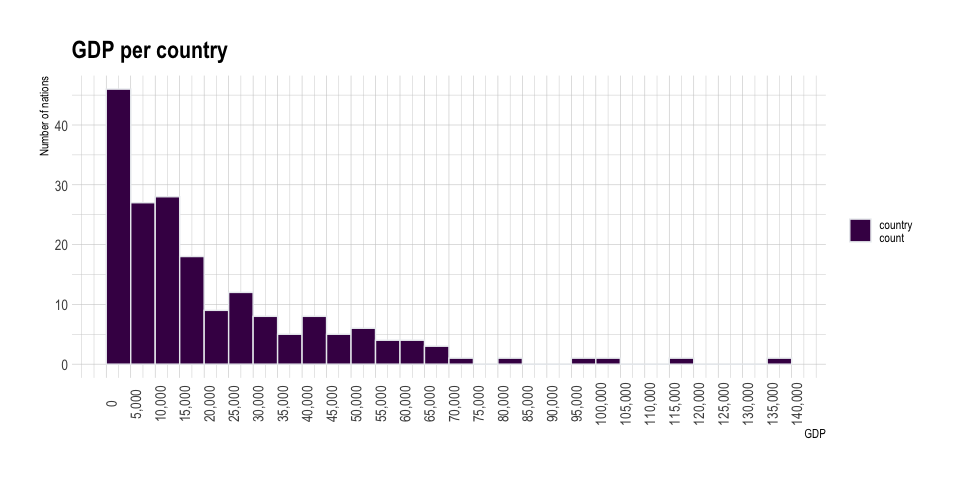

week1
================

# GDP per country

``` r
df <- read.csv("week1/gdp_pc_2018.csv")
glimpse(df)
```

    ## Rows: 217
    ## Columns: 3
    ## $ country <chr> "Andorra", "United Arab Emirates", "Afghanistan", "Antigua an…
    ## $ gdp_pc  <dbl> NA, 68548.5147, 2241.9232, 21614.0661, 13833.9816, 13014.9920…
    ## $ iso3c   <chr> "AND", "ARE", "AFG", "ATG", "ALB", "ARM", "AGO", "ARG", "ASM"…

``` r
# median, mean
gdp_stats <- df %>% summarise(mean = mean(gdp_pc,na.rm = TRUE), 
                              median = median(gdp_pc,na.rm = TRUE), 
                              n = n())
kable(gdp_stats)
```

|     mean |   median |   n |
| -------: | -------: | --: |
| 21835.79 | 13833.98 | 217 |

``` r
q <-  as.data.frame(quantile(df$gdp_pc, na.rm = TRUE, c(0.2, 0.4, 0.6, 0.8)))
colnames(q) <- c("quantiles values")
kable(q)
```

|     | quantiles values |
| :-- | ---------------: |
| 20% |         4017.139 |
| 40% |        10932.866 |
| 60% |        18113.818 |
| 80% |        37314.517 |

``` r
library(scales)
```

    ## 
    ## Attaching package: 'scales'

    ## The following object is masked from 'package:viridis':
    ## 
    ##     viridis_pal

``` r
df %>% ggplot(aes(x = gdp_pc, fill="country\ncount")) +
  geom_histogram(
    color = "#e9ecef",
    binwidth = 5000,
    na.rm = TRUE,
    breaks = seq(0, 140000, by=5000)
  ) +
  scale_fill_viridis(discrete = TRUE) +
  scale_color_viridis(discrete = TRUE) +
  theme_ipsum() +
  labs(title = "GDP per country") +
  ylab("Number of nations") +
  xlab("GDP") +
  scale_x_continuous(labels = comma, breaks = seq(0, 140000, by=5000),limits = c(0,140000)) +
  theme(axis.text.x =element_text(angle=90,size = 11),
        axis.text.y =element_text(size = 11),
        legend.title=element_blank()) 
```

<!-- -->

# COVID-19 data for each US state

## Format the dates

``` r
library(readxl)
df <- read_excel("~/covid19.xlsx", col_types = c("text", "date", "numeric", "numeric", "numeric", "numeric", "text", "numeric", "numeric"))

kable(df)
```

| state                    | date       |   cases | deaths | cases\_new | deaths\_new | state\_postal | state\_fips | population |
| :----------------------- | :--------- | ------: | -----: | ---------: | ----------: | :------------ | ----------: | ---------: |
| Alabama                  | 2021-03-10 |  501398 |  10222 |        782 |          36 | AL            |           1 |    4903185 |
| Alaska                   | 2021-03-10 |   59451 |    291 |        152 |           0 | AK            |           2 |     731545 |
| Arizona                  | 2021-03-10 |  828630 |  16404 |        830 |          78 | AZ            |           4 |    7278717 |
| Arkansas                 | 2021-03-10 |  325700 |   5382 |        317 |          25 | AR            |           5 |    3017804 |
| California               | 2021-03-10 | 3611008 |  54877 |       3464 |         257 | CA            |           6 |   39512223 |
| Colorado                 | 2021-03-10 |  441611 |   6092 |       1132 |           8 | CO            |           8 |    5758736 |
| Connecticut              | 2021-03-10 |  288657 |   7752 |        512 |          13 | CT            |           9 |    3565287 |
| Delaware                 | 2021-03-10 |   88891 |   1492 |        212 |          10 | DE            |          10 |     973764 |
| District of Columbia     | 2021-03-10 |   42006 |   1037 |         96 |           1 | DC            |          11 |     705749 |
| Florida                  | 2021-03-10 | 1957578 |  31947 |       4853 |          59 | FL            |          12 |   21477737 |
| Georgia                  | 2021-03-10 | 1003181 |  17491 |       1840 |          73 | GA            |          13 |   10617423 |
| Guam                     | 2021-03-10 |    8725 |    134 |          4 |           0 | GU            |          66 |     159358 |
| Hawaii                   | 2021-03-10 |   27944 |    445 |         41 |           3 | HI            |          15 |    1415872 |
| Idaho                    | 2021-03-10 |  174381 |   1903 |        459 |           9 | ID            |          16 |    1787065 |
| Illinois                 | 2021-03-10 | 1206362 |  23067 |       1669 |          28 | IL            |          17 |   12671821 |
| Indiana                  | 2021-03-10 |  672439 |  12775 |        869 |          13 | IN            |          18 |    6732219 |
| Iowa                     | 2021-03-10 |  341378 |   5602 |        487 |          27 | IA            |          19 |    3155070 |
| Kansas                   | 2021-03-10 |  300261 |   4851 |        738 |          35 | KS            |          20 |    2913314 |
| Kentucky                 | 2021-03-10 |  416402 |   5026 |       1009 |          25 | KY            |          21 |    4467673 |
| Louisiana                | 2021-03-10 |  435514 |   9812 |        588 |          43 | LA            |          22 |    4648794 |
| Maine                    | 2021-03-10 |   46254 |    723 |        195 |           0 | ME            |          23 |    1344212 |
| Maryland                 | 2021-03-10 |  389748 |   8002 |        900 |          14 | MD            |          24 |    6045680 |
| Massachusetts            | 2021-03-10 |  595264 |  16509 |       1657 |          53 | MA            |          25 |    6892503 |
| Michigan                 | 2021-03-10 |  662553 |  16690 |       2652 |           7 | MI            |          26 |    9986857 |
| Minnesota                | 2021-03-10 |  493081 |   6773 |        905 |           9 | MN            |          27 |    5639632 |
| Mississippi              | 2021-03-10 |  298445 |   6845 |        437 |          11 | MS            |          28 |    2976149 |
| Missouri                 | 2021-03-10 |  572148 |   8728 |        716 |          13 | MO            |          29 |    6137428 |
| Montana                  | 2021-03-10 |  101374 |   1388 |        145 |           2 | MT            |          30 |    1068778 |
| Nebraska                 | 2021-03-10 |  204144 |   2231 |        338 |          10 | NE            |          31 |    1934408 |
| Nevada                   | 2021-03-10 |  297216 |   5069 |        331 |          15 | NV            |          32 |    3080156 |
| New Hampshire            | 2021-03-10 |   77463 |   1187 |        211 |           2 | NH            |          33 |    1359711 |
| New Jersey               | 2021-03-10 |  822817 |  23691 |       3775 |          56 | NJ            |          34 |    8882190 |
| New Mexico               | 2021-03-10 |  187487 |   3841 |        249 |           9 | NM            |          35 |    2096829 |
| New York                 | 2021-03-10 | 1713287 |  48092 |       6106 |          92 | NY            |          36 |   19453561 |
| North Carolina           | 2021-03-10 |  882489 |  11628 |       1904 |          51 | NC            |          37 |   10488084 |
| North Dakota             | 2021-03-10 |  100645 |   1481 |        101 |           2 | ND            |          38 |     762062 |
| Northern Mariana Islands | 2021-03-10 |     146 |      2 |          0 |           0 | MP            |          69 |      53883 |
| Ohio                     | 2021-03-10 |  983487 |  17662 |       1868 |           0 | OH            |          39 |   11689100 |
| Oklahoma                 | 2021-03-10 |  430250 |   4701 |        818 |           0 | OK            |          40 |    3956971 |
| Oregon                   | 2021-03-10 |  158360 |   2314 |        331 |           5 | OR            |          41 |    4217737 |
| Pennsylvania             | 2021-03-10 |  960877 |  24485 |       2611 |          40 | PA            |          42 |   12801989 |
| Puerto Rico              | 2021-03-10 |  135666 |   2071 |        114 |           4 | PR            |          72 |    3193694 |
| Rhode Island             | 2021-03-10 |  129595 |   2559 |        318 |           3 | RI            |          44 |    1059361 |
| South Carolina           | 2021-03-10 |  528473 |   8781 |       1125 |          18 | SC            |          45 |    5148714 |
| South Dakota             | 2021-03-10 |  113962 |   1904 |        209 |           3 | SD            |          46 |     884659 |
| Tennessee                | 2021-03-10 |  772634 |  11506 |       1342 |          17 | TN            |          47 |    6829174 |
| Texas                    | 2021-03-10 | 2710622 |  45956 |       5350 |         202 | TX            |          48 |   28995881 |
| Utah                     | 2021-03-10 |  376327 |   1992 |        691 |           2 | UT            |          49 |    3205958 |
| Vermont                  | 2021-03-10 |   16371 |    211 |         85 |           0 | VT            |          50 |     623989 |
| Virgin Islands           | 2021-03-10 |    2755 |     25 |         11 |           0 | VI            |          78 |     106405 |
| Virginia                 | 2021-03-10 |  589375 |   9849 |       1246 |          59 | VA            |          51 |    8535519 |
| Washington               | 2021-03-10 |  349881 |   5159 |        685 |          18 | WA            |          53 |    7614893 |
| West Virginia            | 2021-03-10 |  134158 |   2330 |        302 |           4 | WV            |          54 |    1792147 |
| Wisconsin                | 2021-03-10 |  623150 |   7151 |        706 |          13 | WI            |          55 |    5822434 |
| Wyoming                  | 2021-03-10 |   55014 |    691 |         42 |           0 | WY            |          56 |     578759 |

## total cases per 100,000 people, and total deaths per 100,000 people

``` r
df_modified <- df %>% 
  mutate(
  case_for_100000 = (df$cases/df$population)*100000,
  death_for_100000 = (df$deaths/df$population)*100000,
)
kable(df_modified)
```

| state                    | date       |   cases | deaths | cases\_new | deaths\_new | state\_postal | state\_fips | population | case\_for\_100000 | death\_for\_100000 |
| :----------------------- | :--------- | ------: | -----: | ---------: | ----------: | :------------ | ----------: | ---------: | ----------------: | -----------------: |
| Alabama                  | 2021-03-10 |  501398 |  10222 |        782 |          36 | AL            |           1 |    4903185 |        10225.9654 |         208.476735 |
| Alaska                   | 2021-03-10 |   59451 |    291 |        152 |           0 | AK            |           2 |     731545 |         8126.7728 |          39.778824 |
| Arizona                  | 2021-03-10 |  828630 |  16404 |        830 |          78 | AZ            |           4 |    7278717 |        11384.2865 |         225.369389 |
| Arkansas                 | 2021-03-10 |  325700 |   5382 |        317 |          25 | AR            |           5 |    3017804 |        10792.6161 |         178.341602 |
| California               | 2021-03-10 | 3611008 |  54877 |       3464 |         257 | CA            |           6 |   39512223 |         9138.9644 |         138.886137 |
| Colorado                 | 2021-03-10 |  441611 |   6092 |       1132 |           8 | CO            |           8 |    5758736 |         7668.5405 |         105.787103 |
| Connecticut              | 2021-03-10 |  288657 |   7752 |        512 |          13 | CT            |           9 |    3565287 |         8096.3188 |         217.429901 |
| Delaware                 | 2021-03-10 |   88891 |   1492 |        212 |          10 | DE            |          10 |     973764 |         9128.5979 |         153.219877 |
| District of Columbia     | 2021-03-10 |   42006 |   1037 |         96 |           1 | DC            |          11 |     705749 |         5951.9744 |         146.936092 |
| Florida                  | 2021-03-10 | 1957578 |  31947 |       4853 |          59 | FL            |          12 |   21477737 |         9114.4519 |         148.744721 |
| Georgia                  | 2021-03-10 | 1003181 |  17491 |       1840 |          73 | GA            |          13 |   10617423 |         9448.4415 |         164.738656 |
| Guam                     | 2021-03-10 |    8725 |    134 |          4 |           0 | GU            |          66 |     159358 |         5475.0938 |          84.087401 |
| Hawaii                   | 2021-03-10 |   27944 |    445 |         41 |           3 | HI            |          15 |    1415872 |         1973.6247 |          31.429395 |
| Idaho                    | 2021-03-10 |  174381 |   1903 |        459 |           9 | ID            |          16 |    1787065 |         9757.9551 |         106.487453 |
| Illinois                 | 2021-03-10 | 1206362 |  23067 |       1669 |          28 | IL            |          17 |   12671821 |         9520.0366 |         182.033821 |
| Indiana                  | 2021-03-10 |  672439 |  12775 |        869 |          13 | IN            |          18 |    6732219 |         9988.3708 |         189.759127 |
| Iowa                     | 2021-03-10 |  341378 |   5602 |        487 |          27 | IA            |          19 |    3155070 |        10819.9818 |         177.555490 |
| Kansas                   | 2021-03-10 |  300261 |   4851 |        738 |          35 | KS            |          20 |    2913314 |        10306.5100 |         166.511403 |
| Kentucky                 | 2021-03-10 |  416402 |   5026 |       1009 |          25 | KY            |          21 |    4467673 |         9320.3330 |         112.497043 |
| Louisiana                | 2021-03-10 |  435514 |   9812 |        588 |          43 | LA            |          22 |    4648794 |         9368.3222 |         211.065494 |
| Maine                    | 2021-03-10 |   46254 |    723 |        195 |           0 | ME            |          23 |    1344212 |         3440.9751 |          53.786159 |
| Maryland                 | 2021-03-10 |  389748 |   8002 |        900 |          14 | MD            |          24 |    6045680 |         6446.7190 |         132.358974 |
| Massachusetts            | 2021-03-10 |  595264 |  16509 |       1657 |          53 | MA            |          25 |    6892503 |         8636.3981 |         239.521115 |
| Michigan                 | 2021-03-10 |  662553 |  16690 |       2652 |           7 | MI            |          26 |    9986857 |         6634.2494 |         167.119645 |
| Minnesota                | 2021-03-10 |  493081 |   6773 |        905 |           9 | MN            |          27 |    5639632 |         8743.1414 |         120.096489 |
| Mississippi              | 2021-03-10 |  298445 |   6845 |        437 |          11 | MS            |          28 |    2976149 |        10027.8917 |         229.995205 |
| Missouri                 | 2021-03-10 |  572148 |   8728 |        716 |          13 | MO            |          29 |    6137428 |         9322.2764 |         142.209408 |
| Montana                  | 2021-03-10 |  101374 |   1388 |        145 |           2 | MT            |          30 |    1068778 |         9485.0381 |         129.867943 |
| Nebraska                 | 2021-03-10 |  204144 |   2231 |        338 |          10 | NE            |          31 |    1934408 |        10553.3062 |         115.332443 |
| Nevada                   | 2021-03-10 |  297216 |   5069 |        331 |          15 | NV            |          32 |    3080156 |         9649.3814 |         164.569587 |
| New Hampshire            | 2021-03-10 |   77463 |   1187 |        211 |           2 | NH            |          33 |    1359711 |         5697.0194 |          87.297963 |
| New Jersey               | 2021-03-10 |  822817 |  23691 |       3775 |          56 | NJ            |          34 |    8882190 |         9263.6726 |         266.724760 |
| New Mexico               | 2021-03-10 |  187487 |   3841 |        249 |           9 | NM            |          35 |    2096829 |         8941.4540 |         183.181366 |
| New York                 | 2021-03-10 | 1713287 |  48092 |       6106 |          92 | NY            |          36 |   19453561 |         8807.0611 |         247.214379 |
| North Carolina           | 2021-03-10 |  882489 |  11628 |       1904 |          51 | NC            |          37 |   10488084 |         8414.2061 |         110.868677 |
| North Dakota             | 2021-03-10 |  100645 |   1481 |        101 |           2 | ND            |          38 |     762062 |        13206.9307 |         194.341143 |
| Northern Mariana Islands | 2021-03-10 |     146 |      2 |          0 |           0 | MP            |          69 |      53883 |          270.9574 |           3.711746 |
| Ohio                     | 2021-03-10 |  983487 |  17662 |       1868 |           0 | OH            |          39 |   11689100 |         8413.7102 |         151.098031 |
| Oklahoma                 | 2021-03-10 |  430250 |   4701 |        818 |           0 | OK            |          40 |    3956971 |        10873.2159 |         118.802993 |
| Oregon                   | 2021-03-10 |  158360 |   2314 |        331 |           5 | OR            |          41 |    4217737 |         3754.6201 |          54.863544 |
| Pennsylvania             | 2021-03-10 |  960877 |  24485 |       2611 |          40 | PA            |          42 |   12801989 |         7505.6852 |         191.259343 |
| Puerto Rico              | 2021-03-10 |  135666 |   2071 |        114 |           4 | PR            |          72 |    3193694 |         4247.9336 |          64.846538 |
| Rhode Island             | 2021-03-10 |  129595 |   2559 |        318 |           3 | RI            |          44 |    1059361 |        12233.3180 |         241.560714 |
| South Carolina           | 2021-03-10 |  528473 |   8781 |       1125 |          18 | SC            |          45 |    5148714 |        10264.1747 |         170.547442 |
| South Dakota             | 2021-03-10 |  113962 |   1904 |        209 |           3 | SD            |          46 |     884659 |        12882.0257 |         215.224171 |
| Tennessee                | 2021-03-10 |  772634 |  11506 |       1342 |          17 | TN            |          47 |    6829174 |        11313.7255 |         168.483041 |
| Texas                    | 2021-03-10 | 2710622 |  45956 |       5350 |         202 | TX            |          48 |   28995881 |         9348.3002 |         158.491477 |
| Utah                     | 2021-03-10 |  376327 |   1992 |        691 |           2 | UT            |          49 |    3205958 |        11738.3634 |          62.134314 |
| Vermont                  | 2021-03-10 |   16371 |    211 |         85 |           0 | VT            |          50 |     623989 |         2623.6039 |          33.814699 |
| Virgin Islands           | 2021-03-10 |    2755 |     25 |         11 |           0 | VI            |          78 |     106405 |         2589.1640 |          23.495137 |
| Virginia                 | 2021-03-10 |  589375 |   9849 |       1246 |          59 | VA            |          51 |    8535519 |         6904.9697 |         115.388414 |
| Washington               | 2021-03-10 |  349881 |   5159 |        685 |          18 | WA            |          53 |    7614893 |         4594.6936 |          67.748818 |
| West Virginia            | 2021-03-10 |  134158 |   2330 |        302 |           4 | WV            |          54 |    1792147 |         7485.8815 |         130.011656 |
| Wisconsin                | 2021-03-10 |  623150 |   7151 |        706 |          13 | WI            |          55 |    5822434 |        10702.5687 |         122.818052 |
| Wyoming                  | 2021-03-10 |   55014 |    691 |         42 |           0 | WY            |          56 |     578759 |         9505.5109 |         119.393392 |

## visualization

``` r
library(echarts4r.maps)
library(echarts4r)

# remove Northern Mariana Islands
df_modified<- df_modified[- grep("Mariana", df_modified$state),]


json <- jsonlite::read_json("https://raw.githubusercontent.com/shawnbot/topogram/master/data/us-states.geojson")
df_modified %>%
  dplyr::mutate(states = state) %>%
  e_charts(states) %>%
  e_map_register("USA", json) %>%
  e_map(case_for_100000, map = "USA") %>% 
  e_visual_map(case_for_100000) %>%
      e_theme("halloween") %>%
  e_title("COVID-19 cases per states", "Total cases per 100,000 people (2021-03-10)")
```

<!-- -->

<iframe src="https://github.com/vincentmanz/Data-Visualization-For-Storytellers/blob/master/week1/death.html" style="width:100%; height:300px;">

</iframe>

``` r
json <- jsonlite::read_json("https://raw.githubusercontent.com/shawnbot/topogram/master/data/us-states.geojson")
df_modified %>%
  dplyr::mutate(states = state) %>%
  e_charts(states) %>%
  e_map_register("USA", json) %>%
  e_map(death_for_100000, map = "USA") %>% 
  e_visual_map(case_for_100000) %>%
      e_theme("vintage") %>%
  e_title("COVID-19 death per states", "Total death per 100,000 people (2021-03-10)")
```

<!-- -->
