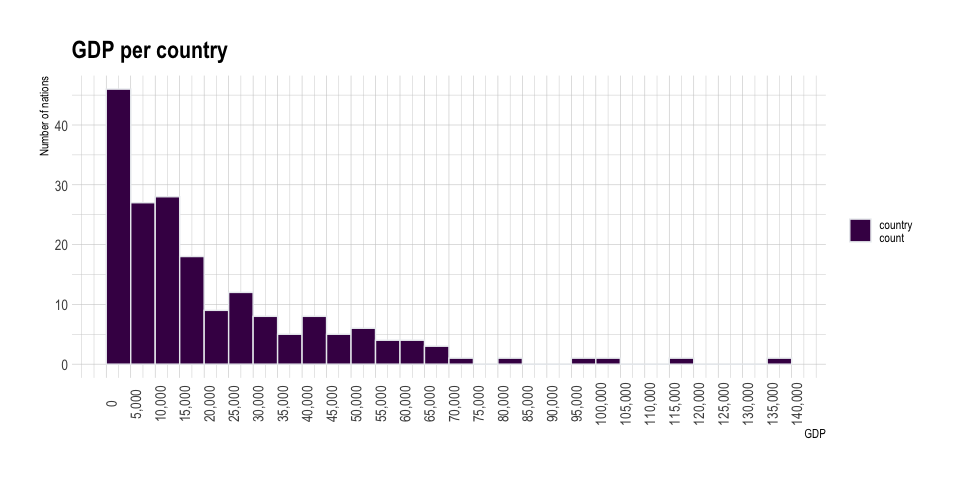

week1
================

``` r
df <- read.csv("week1/gdp_pc_2018.csv")
glimpse(df)
```

    ## Rows: 217
    ## Columns: 3
    ## $ country <chr> "Andorra", "United Arab Emirates", "Afghanistan", "Antigua an…
    ## $ gdp_pc  <dbl> NA, 68548.5147, 2241.9232, 21614.0661, 13833.9816, 13014.9920…
    ## $ iso3c   <chr> "AND", "ARE", "AFG", "ATG", "ALB", "ARM", "AGO", "ARG", "ASM"…

``` r
# median, mean
gdp_stats <- df %>% summarise(mean = mean(gdp_pc,na.rm = TRUE), 
                              median = median(gdp_pc,na.rm = TRUE), 
                              n = n())
kable(gdp_stats)
```

|     mean |   median |   n |
| -------: | -------: | --: |
| 21835.79 | 13833.98 | 217 |

``` r
q <-  as.data.frame(quantile(df$gdp_pc, na.rm = TRUE, c(0.2, 0.4, 0.6, 0.8)))
colnames(q) <- c("quantiles values")
kable(q)
```

|     | quantiles values |
| :-- | ---------------: |
| 20% |         4017.139 |
| 40% |        10932.866 |
| 60% |        18113.818 |
| 80% |        37314.517 |

``` r
library(scales)
```

    ## 
    ## Attaching package: 'scales'

    ## The following object is masked from 'package:viridis':
    ## 
    ##     viridis_pal

``` r
df %>% ggplot(aes(x = gdp_pc, fill="country\ncount")) +
  geom_histogram(
    color = "#e9ecef",
    binwidth = 5000,
    na.rm = TRUE,
    breaks = seq(0, 140000, by=5000)
  ) +
  scale_fill_viridis(discrete = TRUE) +
  scale_color_viridis(discrete = TRUE) +
  theme_ipsum() +
  labs(title = "GDP per country") +
  ylab("Number of nations") +
  xlab("GDP") +
  scale_x_continuous(labels = comma, breaks = seq(0, 140000, by=5000),limits = c(0,140000)) +
  theme(axis.text.x =element_text(angle=90,size = 11),
        axis.text.y =element_text(size = 11),
        legend.title=element_blank()) 
```

<!-- -->

``` r
df <- read.csv("week1/mlb_salaries_2016.csv")
glimpse(df)
```

    ## Rows: 853
    ## Columns: 8
    ## $ playerID   <chr> "ahmedni01", "barreja01", "brachsi01", "britoso01", "casti…
    ## $ nameFirst  <chr> "Nick", "Jake", "Silvino", "Socrates", "Welington", "Andre…
    ## $ nameLast   <chr> "Ahmed", "Barrett", "Bracho", "Brito", "Castillo", "Chafin…
    ## $ nameFull   <chr> "Nick Ahmed", "Jake Barrett", "Silvino Bracho", "Socrates …
    ## $ teamID     <chr> "ARI", "ARI", "ARI", "ARI", "ARI", "ARI", "ARI", "ARI", "A…
    ## $ teamName   <chr> "Arizona Diamondbacks", "Arizona Diamondbacks", "Arizona D…
    ## $ salary     <int> 521600, 507500, 509300, 508500, 3700000, 519700, 6100000, …
    ## $ salary_mil <dbl> 0.521600, 0.507500, 0.509300, 0.508500, 3.700000, 0.519700…
